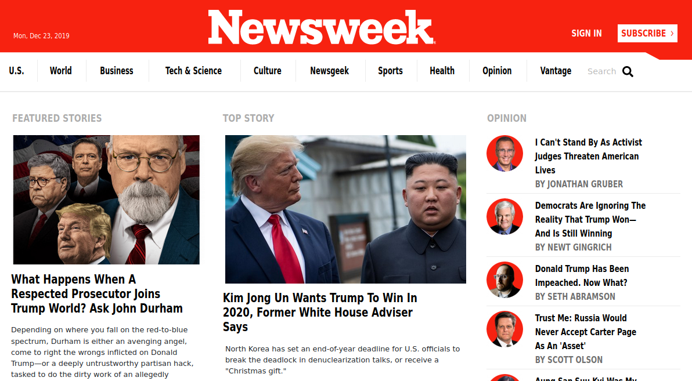

# newsweek-clone

# Bootstrap Micorverse Project

In this project, we'll be building from scratch a copy of this "[Newsweek clone](https://www.newsweek.com/)". The main goal of this project is to learn how to use bootstrap framework.

# Newsweek clone

> A clone of (https://www.newsweek.com/)

Project: Building with Responsive Design

## Built With

- HTML5,
- CSS3,
- Bootstrap

## Live Demo

[Live Demo Link](https://raw.githack.com/kwizl/newsweek-clone/dev/index.html)

## Getting Started

**Use browser of choice**

## Authors

👤 **Martin Njoroge**

- Github: [@kwizl](https://github.com/kwizl)
- Twitter: [@NjoroKaris](https://twitter.com/NjoroKaris)
- Linkedin: [martin njoroge](https://www.linkedin.com/in/martin-kariuki-njoroge/)

## 🤝 Contributing

Contributions, issues and feature requests are welcome!

## Show your support

Give a ⭐️ if you like this project!
